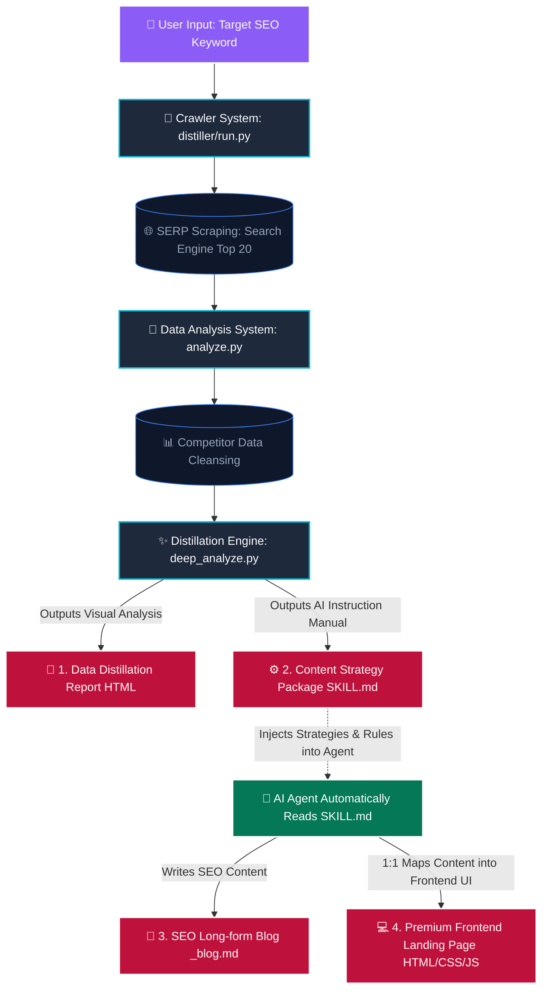

# Fully Automated Execution Flow

Here is the complete end-to-end automated execution map for the `GEO Hybrid Content Writer` system:

### Process Description:
1. **Input Phase:** The user simply inputs a target keyword.
2. **Scraping Phase:** The Python `run.py` script automatically scrapes the top ranking web pages from search engines.
3. **Cleansing & Distillation Analysis:** Extracts read counts, word counts, H2 tags, copywriting formulas, and distills "audience pain points/cognitive layers" from the text.
4. **Generating Initial Deliverables:**
   - **`_distill_report.html`:** A data dashboard report designed for human review.
   - **`SKILL.md` Instruction Package:** A highly specific execution manual designed to guide the AI.
5. **AI Takeover & Generation:** An AI Agent reads the `SKILL.md` and automatically emulates the optimal copywriting formulas found in competitor data.
6. **Final Output:** 
   - First File: A pure text, long-form blog document `_blog.md` (>1500 words) strictly structured for long-tail keyword coverage and semantic ranking.
   - Output Folder: A top-tier, premium UI landing page bundle (`index.html`, `styles.css`, `script.js`) generated by mapping the blog content 1:1 into the frontend structure.

**Zero-click required after the initial input. The entire pipeline runs autonomously!**
